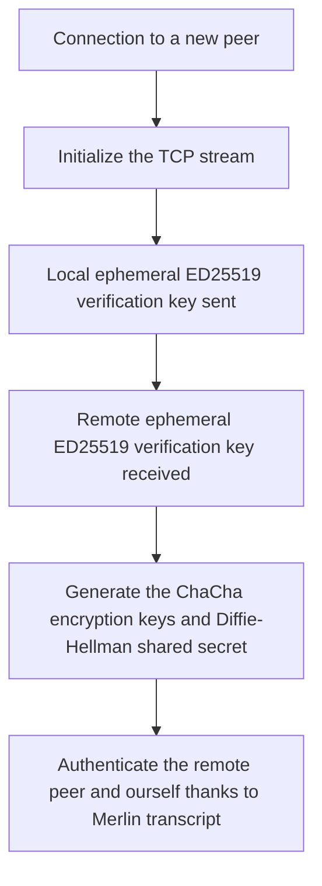

```mermaid
graph TD
    1[Connection to a new peer] --> 2[Initialize the TCP stream];
    2 --> 3[Local ephemeral ED25519 verification key sent];
    3 --> 4[Remote ephemeral ED25519 verification key received];
    4 --> 5[Generate the ChaCha encryption keys and Diffie-Hellman shared secret];
    5 --> 6[Authenticate the remote peer and ourself thanks to Merlin transcript];
```
